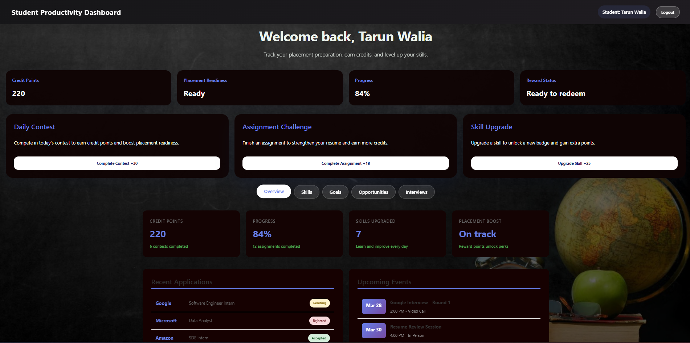
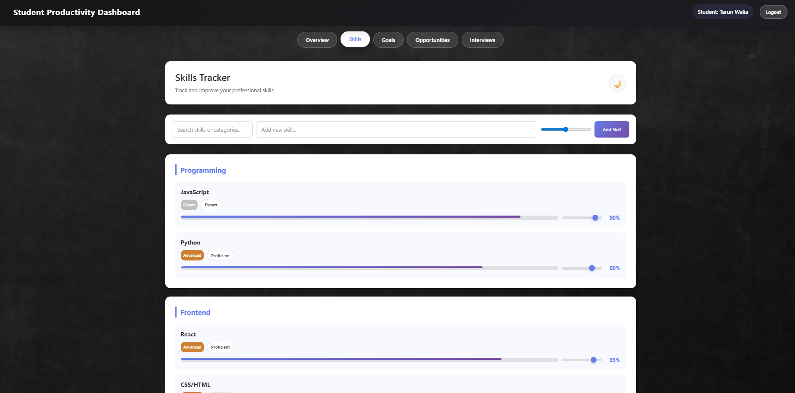
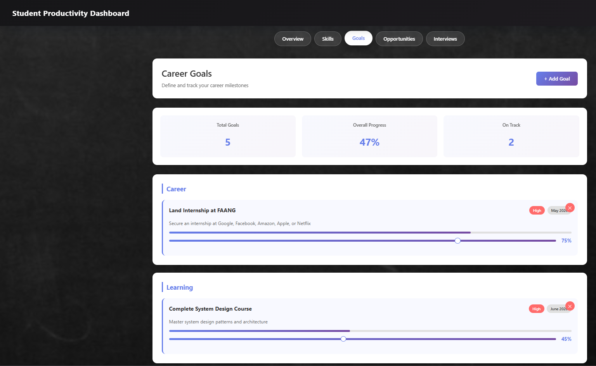
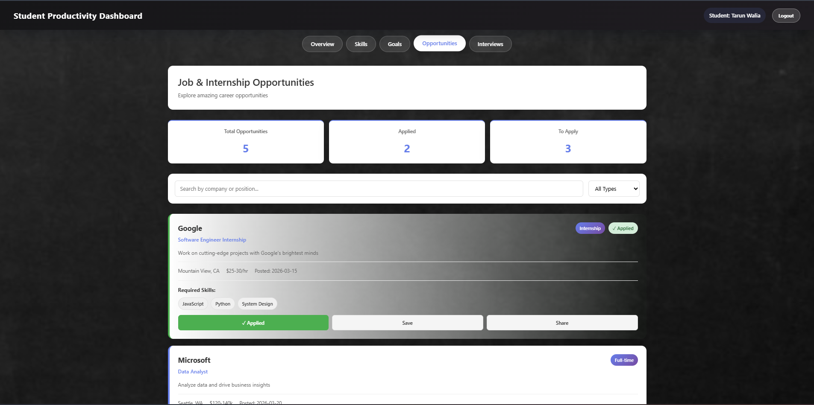
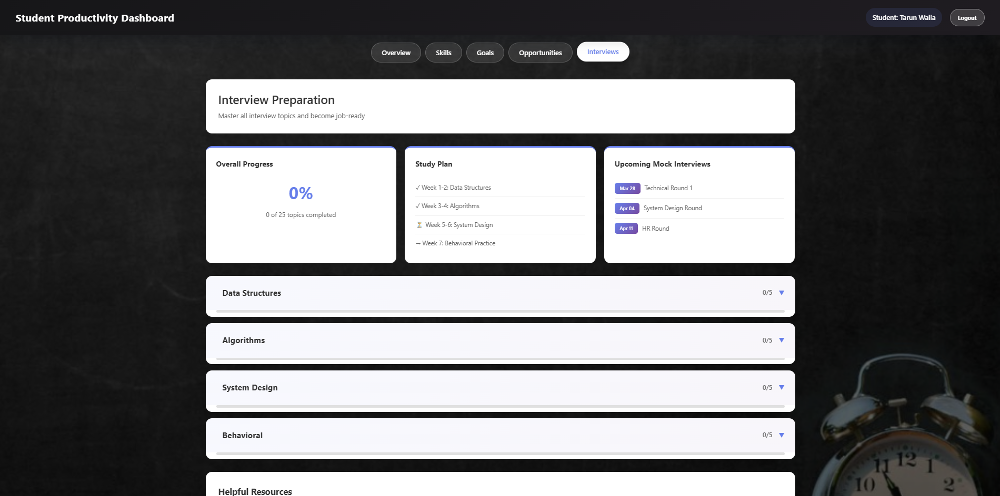
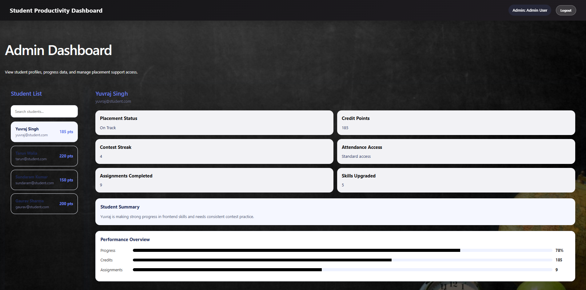
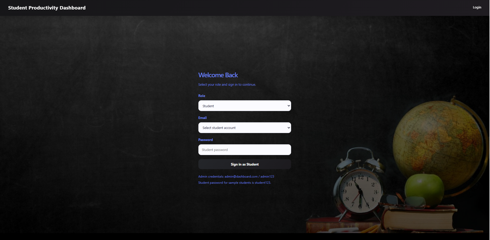

# Student Productivity Dashboard

## Problem Statement

Students often struggle to manage multiple aspects of their academic and placement preparation such as skills, goals, interviews, and job opportunities. There is no single platform that integrates **progress tracking, skill development, and placement readiness** in a structured and visual manner.

This project solves that problem by providing a **centralized dashboard** where students can monitor their performance, manage goals, and prepare effectively for placements.

---

## Project Overview

The **Student Productivity Dashboard** is a frontend-based web application that helps students track their academic and placement journey. It provides a **data-driven and visually interactive interface** to monitor progress, manage skills, prepare for interviews, and explore job opportunities.

It also includes an **Admin Dashboard** for monitoring student performance and managing access.

---

## Key Features

### Student Dashboard

**\*Overview Section**

- Credit points tracking
- Placement readiness status
- Progress percentage
- Reward system

- **Daily Productivity System**
  - Daily contest participation
  - Assignment challenges
  - Skill upgrade system

- **Progress Tracking**
  - Real-time performance metrics
  - Completed assignments and contests
  - Placement boost indicators

---

### Skills Tracker

- Add and manage skills
- Proficiency levels (Beginner → Expert)
- Progress bars for each skill
- Category-wise organization (Programming, Frontend, etc.)

---

### Goals Management

- Create and track career goals
- Progress sliders for each goal
- Priority tagging (High priority goals)
- Categorization (Career / Learning)

---

### Opportunities Section

- Job & Internship listings
- Search and filter functionality
- Apply / Save / Share options
- Track applied and pending opportunities

---

### Interview Preparation

- Structured study plan (DSA, Algorithms, System Design, etc.)
- Mock interview schedule
- Topic-wise progress tracking

---

### Admin Dashboard

- View student list and profiles
- Monitor student performance (credits, progress, assignments)
- Provide feedback through notes
- Manage placement access

---

### Authentication System

- Role-based login (Student / Admin)
- Demo credentials for testing

---

## Tech Stack

- **Frontend:** HTML, CSS, JavaScript
- **UI Design:** Responsive layout with modern dashboard components
- **Version Control:** Git & GitHub

---

## Installation & Setup

1. Clone the repository:

```bash
git clone https://github.com/TarunWalia01/Student-Productivity-Dashboard.git
```

2. Open the project folder:

```bash
cd Student-Productivity-Dashboard
```

3. Run the project:

- Open `index.html` in browser
  OR
- Use Live Server (VS Code recommended)

---

## Screenshots

### Overview Dashboard



### Skills Tracker



## Goals Section



### Opportunities



### Interview Preparation



### Admin Dashboard



### Login Page



---

## Project Workflow

1. User logs in (Student/Admin)
2. Dashboard displays real-time data
3. User interacts with modules:
   - Skills
   - Goals
   - Opportunities
   - Interviews

4. Progress is visualized using charts and indicators
5. Admin monitors and manages student performance

---

## Future Scope

- Backend integration (Node.js / Firebase)
- Database storage for persistent data
- Real-time analytics
- AI-based recommendations for skills and jobs
- Mobile application version

---

## Learning Outcomes

- Frontend architecture design
- Dashboard UI/UX development
- State handling and dynamic UI updates
- Role-based interface design
- GitHub project management

---

## Conclusion

This project demonstrates how a unified dashboard can significantly improve student productivity by combining **task management, skill tracking, and placement preparation** into a single platform.

---
